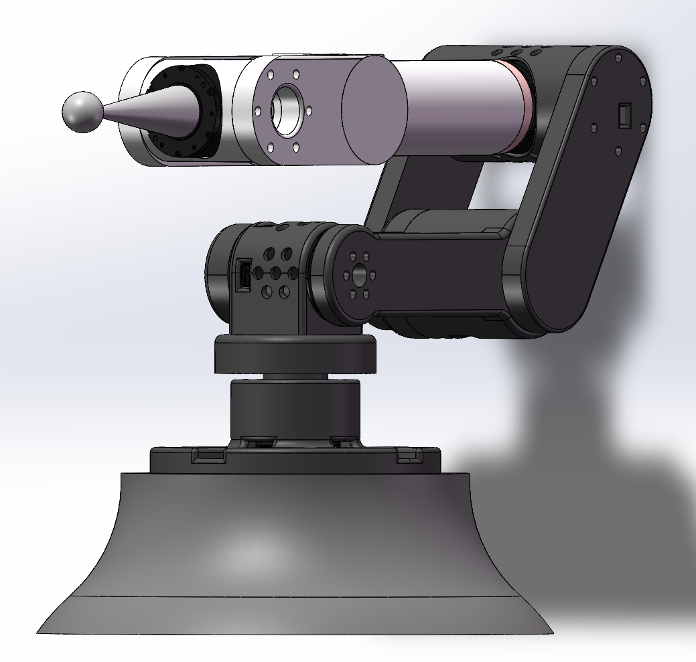
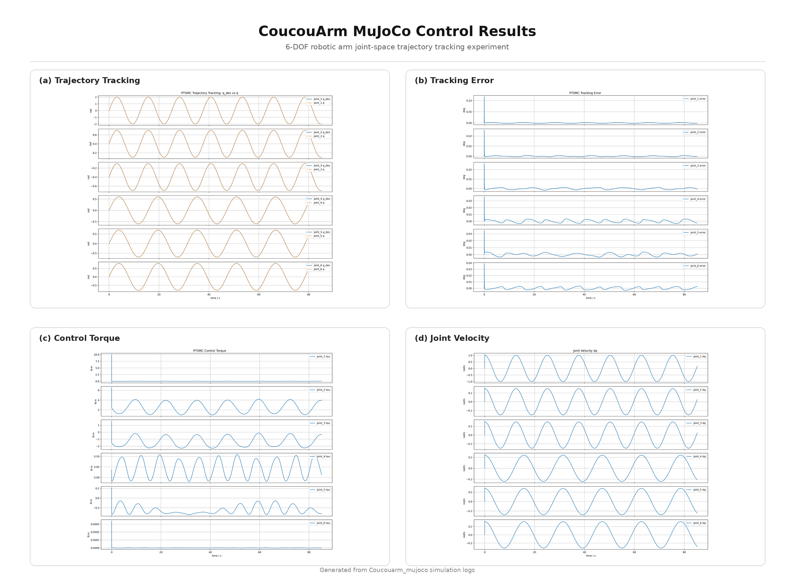

Coucouarm_mujoco是一个基于Mujoco仿真环境的6自由度机械臂控制验证项目。该项目以基于达妙电机的6自由度机械臂为研究对象，主要用于验证和对比不同控制器在机械臂关节空间轨迹跟踪任务中的控制性能

项目包含机械臂建模文件、控制器代码、轨迹生成模块、实验运行脚本、CSV 数据记录工具和绘图分析脚本，可用于机械臂控制算法的仿真验证与控制性能对比

目前算法已验证 pid、super-twisting smc，如果你需要验证自己控制方法可自行编写python代码，并通过 experiments 文件夹内的 plot 代码进行图形化显示

模型文件:
coucouarm_v5_urdf/

控制器代码:
coucouarm/controllers/

轨迹生成文件：
coucouarm/trajectory/sine_reference_continuous.py

实验脚本 & 绘图文件：
experiments/

推荐环境:
Ubuntu 20.04 / 22.04
Python 3.8+
MuJoCo
NumPy
Pandas
Matplotlib

*********************************************************************

Coucouarm_mujoco is a 6-DOF robotic arm control validation project based on the MuJoCo simulation environment. The project focuses on a 6-DOF robotic arm driven by Damiao motors and is mainly used to validate and compare the trajectory tracking performance of different controllers in joint-space robotic arm control tasks.

The project includes robotic arm model files, controller code, trajectory generation modules, experiment scripts, CSV data logging tools, and plotting scripts. It can be used for simulation validation and control performance comparison of robotic arm control algorithms.

Currently, PID and super-twisting SMC algorithms have been verified. If you need to test your own control method, you can write the corresponding Python code and use the plotting scripts in the `experiments` folder to visualize the results.

Model files:
coucouarm_v5_urdf/

Controller code:
coucouarm/controllers/

Trajectory generation file:
coucouarm/trajectory/sine_reference_continuous.py

Experiment scripts and plotting files:
experiments/

Recommended environment:
Ubuntu 20.04 / 22.04
Python 3.8+
MuJoCo
NumPy
Pandas
Matplotlib

## Results Preview

